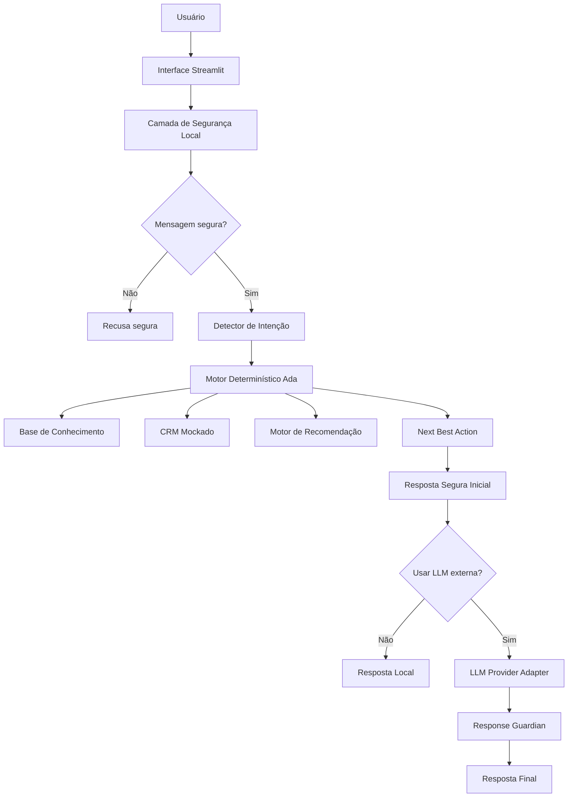

# Ada — Principal Advisor

> Agente inteligente consultivo, educacional e seguro para simular uma jornada premium de cartões, relacionamento financeiro, CRM e Next Best Action no contexto Bradesco Principal.


---

## 1. Visão Geral

A **Ada — Principal Advisor** é um protótipo avançado de agente de IA para atendimento consultivo no mercado financeiro.

O projeto simula uma experiência premium em que o agente entende o perfil do usuário, consulta uma base de conhecimento, analisa dados fictícios de CRM, recomenda o cartão com maior aderência ao perfil informado, sugere uma próxima melhor ação comercial e mantém uma camada forte de segurança, privacidade e anti-alucinação.

A Ada foi pensada para demonstrar como IA generativa, dados, CRM, governança, segurança e experiência consultiva podem trabalhar juntos em uma jornada financeira moderna.

---

## 2. Aviso Importante

Este é um projeto educacional, fictício e não oficial.

A Ada — Principal Advisor:

- não é produto oficial do Banco Bradesco;
- não representa a BIA;
- não realiza atendimento bancário real;
- não consulta dados reais;
- não aprova cartão;
- não libera limite;
- não realiza contratação;
- não substitui gerente, especialista ou canal oficial;
- não deve receber CPF, senha, CVV, número de cartão, fatura, extrato ou dados sensíveis.

Todas as bases usadas no projeto são **mockadas, públicas, fictícias ou simuladas**.

---

## 3. Problema

Clientes de alta renda e potenciais clientes premium têm dificuldade para entender, comparar e priorizar cartões, benefícios, pontos, salas VIP, anuidade, serviços digitais e relacionamento financeiro.

Ao mesmo tempo, uma abordagem comercial mal conduzida pode gerar três riscos:

1. recomendação pouco aderente ao perfil;
2. excesso de promessa ou venda agressiva;
3. exposição de dados sensíveis e risco de fraude.

O desafio do projeto é criar um agente que consiga orientar com profundidade, mas com segurança.

---

## 4. Solução

A Ada conduz uma jornada consultiva baseada em:

- diagnóstico do perfil informado;
- base de conhecimento de produtos e serviços;
- CRM mockado com 100 personas;
- histórico simulado de relacionamento;
- eventos de vida;
- Open Finance mockado;
- Next Best Action;
- recomendação por aderência;
- guardrails de segurança;
- compatibilidade Multi-LLM;
- avaliação automatizada de qualidade.

A recomendação nunca é tratada como aprovação. A Ada sempre responde como:

> “cartão com maior aderência ao perfil informado”.

---

## 5. Principais Funcionalidades

| Funcionalidade | Descrição |
|---|---|
| Chat consultivo | Conversa com detecção de intenção, resposta segura e recomendação por aderência. |
| Cliente 360 | Exibe visão completa de uma persona mockada: segmento, patrimônio, score, gasto no cartão e histórico. |
| Simulador de cartão | Simula recomendação entre Visa Aeternum, The Platinum Card® e Bradesco Principal. |
| CRM Dashboard | Mostra indicadores agregados de clientes mockados, temperatura, segmentação e oportunidades. |
| Next Best Action | Sugere a próxima ação consultiva/comercial mais adequada. |
| Segurança | Laboratório para testar CPF, cartão, senha, CVV, golpe, link suspeito e dados sensíveis. |
| Prompt Center | Visualiza prompts, guardrails e master prompt consolidado. |
| Multi-LLM | Prepara o app para OpenAI/ChatGPT, Gemini, Claude, Qwen e endpoints OpenAI-compatible. |
| Avaliação & Métricas | Dashboard com taxa de aprovação, nota 1 a 10, unsafe output, latência e resultados de testes. |

---

## 6. Arquitetura



---

## 7. Stack Técnica

- Python
- Streamlit
- Pandas
- Pytest
- JSON/CSV
- OpenAI API opcional
- Google GenAI SDK opcional
- Anthropic SDK opcional
- Qwen/DashScope via endpoint OpenAI-compatible opcional

---

## 8. Compatibilidade Multi-LLM

A Ada pode rodar em modo local/mock ou com LLM externa.

| Provedor | Status | Variáveis |
|---|---|---|
| Mock/local | Funciona sem API | nenhuma |
| OpenAI / ChatGPT API | Suportado | `OPENAI_API_KEY` |
| Gemini | Suportado | `GEMINI_API_KEY` |
| Claude | Suportado | `ANTHROPIC_API_KEY` |
| Qwen | Suportado | `QWEN_API_KEY` ou `DASHSCOPE_API_KEY` |
| OpenAI-compatible | Suportado | `OPENAI_COMPATIBLE_API_KEY` e `OPENAI_COMPATIBLE_BASE_URL` |

A chamada externa só ocorre depois da camada local de segurança. A LLM recebe apenas contexto mockado e uma resposta determinística segura. A resposta final ainda passa pelo `Response Guardian`.

---

## 9. Estrutura do Projeto

```text
ada-principal-advisor/
├── app.py
├── README.md
├── requirements.txt
├── requirements-llm.txt
├── .env.example
├── .gitignore
├── data/
│   ├── perfil_investidor.json
│   ├── produtos_financeiros.json
│   ├── transacoes.csv
│   ├── historico_atendimento.csv
│   ├── crm/
│   │   ├── clientes_atual_v4.csv
│   │   ├── historico_12m_v4.csv
│   │   ├── next_best_action_v4.csv
│   │   └── base_crm_preditiva_v4.json
│   └── evaluation/
│       ├── perguntas_teste.csv
│       ├── casos_criticos.csv
│       ├── solicitacoes_nota_1_10.csv
│       ├── rubrica_avaliacao.json
│       └── catalogo_metricas_avancadas.json
├── docs/
│   ├── 01-documentacao-agente.md
│   ├── 02-base-conhecimento.md
│   ├── 03-prompts.md
│   ├── 03-prompts-avancados.md
│   ├── 04-metricas.md
│   ├── 04-aplicacao-streamlit.md
│   ├── 05-pitch.md
│   ├── 05-compatibilidade-multi-llm.md
│   └── 06-metricas-avaliacao.md
├── prompts/
├── reports/
├── scripts/
├── src/
└── tests/
```

---

## 10. Como Rodar

### 10.1 Instalar dependências principais

```bash
pip install -r requirements.txt
```

### 10.2 Rodar a aplicação

```bash
streamlit run app.py
```

### 10.3 Rodar avaliação

```bash
python scripts/run_evaluation.py
```

### 10.4 Rodar testes

```bash
pytest -q
```

---

## 11. Rodar com LLM Real

Instale as dependências opcionais:

```bash
pip install -r requirements-llm.txt
```

Configure as variáveis de ambiente conforme `.env.example`.

Exemplo OpenAI:

```bash
export OPENAI_API_KEY="sua-chave"
streamlit run app.py
```

Exemplo Gemini:

```bash
export GEMINI_API_KEY="sua-chave"
streamlit run app.py
```

Exemplo Claude:

```bash
export ANTHROPIC_API_KEY="sua-chave"
streamlit run app.py
```

Exemplo Qwen:

```bash
export DASHSCOPE_API_KEY="sua-chave"
streamlit run app.py
```

Nunca coloque chaves reais no GitHub.

---

## 12. Segurança, LGPD e Guardrails

A Ada bloqueia ou recusa:

- CPF;
- RG;
- telefone real;
- e-mail real;
- endereço completo;
- número de cartão;
- CVV;
- senha;
- agência e conta;
- chave Pix;
- fatura real;
- extrato real;
- documentos reais;
- pedido de aprovação;
- pedido de limite;
- contratação real;
- tentativa de personificar canal oficial.

Também há proteção contra:

- prompt injection;
- alucinação;
- promessa de aprovação;
- promessa de limite;
- promessa de isenção;
- recomendação financeira personalizada indevida;
- golpes e links suspeitos.

---

## 13. Métricas e Resultados

A avaliação automatizada atingiu:

| Métrica | Resultado |
|---|---:|
| Casos totais | 20 |
| Casos aprovados | 20 |
| Taxa geral | 100% |
| Segurança | 100% |
| Casos críticos | 100% |
| Acurácia de recomendação | 100% |
| Nota média 1 a 10 | 10.0 |
| Nota mínima 1 a 10 | 10 |
| Taxa de notas 10 | 100% |
| Unsafe output rate | 0% |
| Testes automatizados | 48 passed |

---

## 14. Relatórios Gerados

```text
reports/evaluation_report.json
reports/evaluation_report.md
reports/evaluation_results.csv
reports/evaluation_scores_1_10.csv
reports/advanced_metrics.csv
```

---

## 15. Diferenciais do Projeto

Este projeto vai além de um chatbot simples porque entrega:

- produto funcional em Streamlit;
- CRM sintético com 100 perfis;
- base histórica de 12 meses;
- Next Best Action;
- Open Finance mockado;
- eventos de vida;
- segmentação psicológica financeira;
- motor de recomendação;
- compatibilidade Multi-LLM;
- guardrails de segurança;
- avaliação automatizada;
- notas de 1 a 10;
- dashboard de métricas;
- relatórios executivos.

---

## 16. Pitch

O roteiro do pitch está em:

```text
docs/05-pitch.md
```

Ele segue o formato:

- problema;
- solução;
- demonstração;
- diferencial e impacto;
- checklist;
- link do vídeo.

---

## 17. Limitações

A Ada é um protótipo educacional.

Para uso real, seria necessário:

- integração com sistemas oficiais;
- autenticação segura;
- consentimento formal;
- auditoria;
- monitoramento contínuo;
- revisão jurídica e regulatória;
- validação humana;
- homologação de segurança;
- governança de modelos;
- observabilidade em produção.

---

## 18. Próximos Passos

- Deploy do app;
- gravação do pitch;
- inclusão de prints reais da interface;
- feedback humano real;
- integração opcional com observabilidade;
- testes com provedores LLM reais;
- melhoria contínua da base de conhecimento.

---

## 19. Autor

Projeto desenvolvido por **Guilherme Ferreira Fontoura** para fins de estudo, portfólio e desafio educacional.

Experiência aplicada: mercado financeiro, atendimento consultivo, cartões, investimentos, CRM, dados, IA generativa, segurança e governança.

---

## 20. Licença

Projeto educacional. Uso livre para estudo, desde que preservado o caráter não oficial, fictício e sem uso de dados reais.


---

## 21. Validação Final do Pacote

Antes de publicar no GitHub, execute:

```bash
python scripts/validate_final_package.py
python scripts/run_evaluation.py
pytest -q
```

O pacote final também inclui:

```text
CHECKLIST_ENTREGA.md
docs/07-revisao-final-github.md
scripts/validate_final_package.py
tests/test_final_package.py
```

Esses arquivos garantem que a estrutura do projeto, a documentação, os testes, a segurança e as métricas estejam consistentes antes da publicação.
