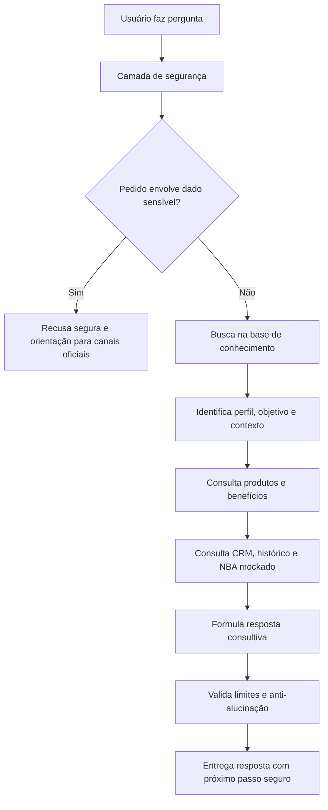

# Base de Conhecimento da Ada — Principal Advisor

## 1. Objetivo da Base

A base de conhecimento da Ada — Principal Advisor foi desenhada para sustentar uma experiência consultiva, comercial e segura para clientes e potenciais clientes de alta renda, com foco no segmento Bradesco Principal.

A Ada não atua como um chatbot genérico. Ela usa dados públicos, dados fictícios e bases mockadas para:

- entender o perfil informado pelo usuário;
- explicar cartões, benefícios e serviços;
- comparar alternativas de forma consultiva;
- recomendar o cartão com maior aderência ao perfil declarado;
- sugerir a próxima melhor ação comercial;
- apoiar uma jornada de planejamento financeiro;
- reforçar segurança digital e proteção de dados;
- reduzir alucinações usando respostas ancoradas na base.

Todas as bases deste projeto são educacionais, sintéticas ou públicas. Nenhum arquivo contém CPF, telefone, e-mail real, número de conta, número de cartão, senha, fatura, extrato ou dado real de cliente.

---

## 2. Arquivos obrigatórios do lab

A estrutura original do desafio da DIO utiliza quatro arquivos principais dentro da pasta `data/`. Eles foram mantidos para preservar aderência ao projeto.

### 2.1 `data/perfil_investidor.json`

Representa um perfil exemplo completo para a Ada realizar diagnóstico consultivo.

Uso no agente:

- identificar segmento atual e segmento alvo;
- entender renda, patrimônio, objetivos e perfil de risco;
- avaliar interesse em cartões, pontos, salas VIP e isenção de anuidade;
- simular recomendação por aderência;
- direcionar a conversa para o próximo passo comercial seguro.

### 2.2 `data/produtos_financeiros.json`

Representa a base de produtos, serviços, benefícios e temas que a Ada pode explicar.

Uso no agente:

- responder sobre cartões Principal;
- explicar benefícios e serviços;
- comparar produtos por aderência;
- reforçar limites de contratação;
- citar que a confirmação deve ocorrer em canais oficiais.

### 2.3 `data/transacoes.csv`

Representa uma amostra fictícia de movimentações financeiras e uso de cartão para um cliente mock de alta renda.

Uso no agente:

- identificar padrão de gastos;
- avaliar concentração no cartão;
- estimar aderência a benefícios;
- apoiar a conversa sobre planejamento financeiro;
- simular capacidade de poupança, investimentos e despesas recorrentes.

### 2.4 `data/historico_atendimento.csv`

Representa histórico fictício de interações consultivas entre cliente, Ada e canais de atendimento.

Uso no agente:

- manter contexto entre canais;
- evitar que o cliente repita informações;
- detectar objeções;
- identificar lacunas de planejamento;
- acionar handoff para gerente ou especialista.

---

## 3. Camada avançada de CRM

Além dos arquivos originais do lab, o projeto inclui uma camada avançada em `data/crm/`.

Essa camada coloca o projeto acima do básico e permite demonstrar conceitos de Data-Driven Banking.

### 3.1 `clientes_atual_v4.csv`

Foto atual dos 100 perfis fictícios.

Inclui:

- 50 perfis Principal;
- 50 perfis Prime com potencial de migração para Principal;
- renda mockada;
- patrimônio mockado;
- investimentos mockados;
- perfil de risco;
- psicologia financeira;
- comportamento de cartão;
- prioridade de atendimento;
- propensão simulada;
- risco de churn;
- próxima oportunidade comercial.

### 3.2 `historico_12m_v4.csv`

Histórico mensal de 12 meses por persona.

Inclui:

- renda mensal;
- investimentos;
- gastos no cartão;
- interações digitais;
- contatos com gerente;
- tendência de crescimento, estabilidade ou atenção.

Essa base permite que a Ada saia de uma análise estática e passe a observar tendência.

### 3.3 `next_best_action_v4.csv`

Motor prescritivo mockado de Next Best Action.

Inclui:

- próxima melhor ação;
- produto ou tema prioritário;
- melhor canal prescritivo;
- urgência;
- motivo da recomendação;
- mensagem consultiva sugerida;
- guardrail de segurança.

Essa base permite que a Ada não apenas responda, mas sugira uma ação consultiva.

### 3.4 `base_crm_preditiva_v4.json`

Base consolidada em JSON, contendo:

- clientes;
- histórico de 12 meses;
- Open Finance mockado;
- eventos de vida;
- interações omnichannel;
- Next Best Action.

É o arquivo mais completo para uso em protótipos avançados.

---

## 4. Camadas de inteligência

A base foi organizada em cinco camadas.

### 4.1 Camada descritiva

Responde: "quem é o cliente hoje?"

Exemplos:

- segmento atual;
- renda;
- patrimônio;
- perfil investidor;
- cartão atual;
- gasto mensal no cartão;
- objetivos financeiros.

### 4.2 Camada histórica

Responde: "como esse cliente evoluiu?"

Exemplos:

- crescimento de renda;
- aumento ou queda dos investimentos;
- evolução do gasto no cartão;
- engajamento digital;
- contatos com gerente.

### 4.3 Camada preditiva

Responde: "qual oportunidade pode surgir?"

Exemplos:

- potencial de migração Prime para Principal;
- propensão simulada para cartão;
- risco de churn;
- gap de relacionamento;
- ativos externos mapeados com consentimento mockado.

### 4.4 Camada prescritiva

Responde: "qual a próxima melhor ação?"

Exemplos:

- apresentar cartão Principal por aderência;
- trabalhar retenção antes da oferta;
- solicitar consentimento Open Finance de forma transparente;
- agendar conversa de wealth planning;
- oferecer diagnóstico de proteção familiar;
- conduzir migração Prime para Principal.

### 4.5 Camada de governança

Responde: "o que o agente pode ou não pode fazer?"

Exemplos:

- não solicitar dados sensíveis;
- não aprovar crédito;
- não prometer limite;
- não afirmar elegibilidade real;
- não substituir canais oficiais;
- não usar dados reais no GitHub.

---

## 5. Como a Ada usa a base

A Ada segue este fluxo:

---

## 6. Regras de recomendação

A Ada nunca deve afirmar que um cartão é "garantido", "aprovado" ou "ideal" de forma absoluta.

A frase correta é:

> "Com base no perfil informado, o cartão com maior aderência parece ser..."

A recomendação deve considerar:

- objetivo do cliente;
- frequência de viagens;
- interesse em salas VIP;
- interesse em pontos;
- gasto mensal estimado;
- investimentos e relacionamento;
- prioridade de isenção;
- necessidade de atendimento premium;
- segurança e proteção;
- momento de vida.

---

## 7. Anti-alucinação

A Ada deve admitir limitação quando:

- a pergunta não estiver na base;
- o usuário pedir condição real de contratação;
- o usuário pedir aprovação, limite ou análise de crédito;
- a informação depender de regra atualizada do banco;
- a resposta exigir dado real do cliente.

Resposta padrão:

> "Não encontrei essa informação na minha base pública atual. Para evitar erro, recomendo consultar o app Bradesco, o Internet Banking, sua agência, seu gerente ou os canais oficiais do banco."

---

## 8. Dados proibidos

A base não deve conter:

- CPF;
- RG;
- telefone;
- e-mail real;
- endereço completo;
- número de conta;
- agência;
- número de cartão;
- CVV;
- senha;
- fatura real;
- extrato real;
- chave Pix real;
- documentos;
- geolocalização precisa.

---

## 9. Aviso de não oficialidade

Este projeto é educacional, desenvolvido para fins de estudo e portfólio.

A Ada — Principal Advisor não é um produto oficial do Banco Bradesco, não representa atendimento real e não realiza contratação, aprovação, análise de crédito ou consulta de dados bancários.

Todas as informações utilizadas são públicas, fictícias ou simuladas.
