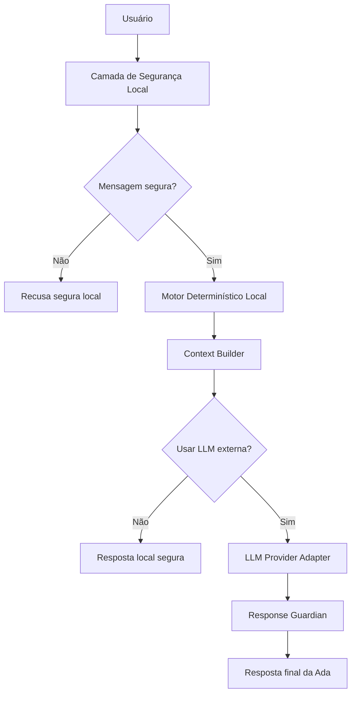

# Compatibilidade Multi-LLM — Ada — Principal Advisor

## 1. Objetivo

Esta etapa prepara a Ada para funcionar com diferentes provedores de LLM:

- OpenAI / ChatGPT API;
- Google Gemini;
- Anthropic Claude;
- Qwen / Alibaba Cloud DashScope;
- qualquer endpoint OpenAI-compatible;
- modo `mock` local, sem chamada externa.

O projeto agora tem uma camada de abstração chamada `LLMClient`, localizada em:

```text
src/llm_client.py
```

A aplicação Streamlit continua funcionando mesmo sem chave de API, usando o modo `mock`.

---

## 2. Decisão arquitetural

A Ada usa uma arquitetura em camadas:



A parte mais importante: a segurança é aplicada antes da chamada ao provedor externo. A LLM nunca recebe CPF, senha, cartão, CVV ou dados reais porque a camada local bloqueia isso antes.

---

## 3. Provedores suportados

| Provedor | Modo | Arquivo/Classe | Variável de ambiente |
|---|---|---|---|
| `mock` | Local, sem API | `LLMClient._mock_generate` | nenhuma |
| `openai` | OpenAI Responses API | `LLMClient._openai_generate` | `OPENAI_API_KEY` |
| `gemini` | Google GenAI SDK | `LLMClient._gemini_generate` | `GEMINI_API_KEY` |
| `claude` | Anthropic Messages API | `LLMClient._claude_generate` | `ANTHROPIC_API_KEY` |
| `qwen` | OpenAI-compatible via DashScope | `LLMClient._qwen_generate` | `QWEN_API_KEY` ou `DASHSCOPE_API_KEY` |
| `openai_compatible` | Endpoint genérico | `LLMClient._openai_compatible_generate` | `OPENAI_COMPATIBLE_API_KEY` e `OPENAI_COMPATIBLE_BASE_URL` |

---

## 4. Comportamento por provedor

### 4.1 OpenAI / ChatGPT API

Uso recomendado para a aplicação:

```text
provider = openai
model = gpt-5.5
env = OPENAI_API_KEY
```

A integração usa a Responses API.

Observação importante: rodar "dentro do ChatGPT" como Custom GPT não é igual a rodar o Streamlit. No ChatGPT, você pode reaproveitar prompts e base de conhecimento, ou criar uma Action/API externa. Para o app deste projeto, a integração correta é via OpenAI API.

### 4.2 Gemini

Uso recomendado:

```text
provider = gemini
model = gemini-3.5-flash
env = GEMINI_API_KEY
```

A integração usa o Google GenAI SDK e `generate_content`.

### 4.3 Claude

Uso recomendado:

```text
provider = claude
model = claude-sonnet-4-6
env = ANTHROPIC_API_KEY
```

A integração usa a Messages API nativa da Anthropic.

Ponto de atenção: Claude trabalha com um único system prompt inicial. Por isso o projeto consolida os prompts em `build_master_prompt()` antes da chamada.

### 4.4 Qwen

Uso recomendado:

```text
provider = qwen
model = qwen-plus
env = QWEN_API_KEY ou DASHSCOPE_API_KEY
base_url = https://dashscope.aliyuncs.com/compatible-mode/v1
```

A integração usa a compatibilidade com Chat Completions da OpenAI.

### 4.5 OpenAI-compatible

Esse modo permite usar qualquer endpoint compatível com Chat Completions.

Exemplos de uso:

```text
provider = openai_compatible
OPENAI_COMPATIBLE_API_KEY=...
OPENAI_COMPATIBLE_BASE_URL=...
```

---

## 5. Segurança da integração

A aplicação usa três barreiras:

### 5.1 Pré-validação local

Antes da LLM externa, a Ada valida:

- CPF;
- cartão;
- senha;
- CVV;
- fatura;
- extrato;
- conta;
- agência;
- pedidos de aprovação;
- pedidos de limite real.

### 5.2 Contexto controlado

A LLM recebe apenas:

- pergunta do usuário;
- resposta determinística segura;
- perfil mockado;
- produtos mockados/públicos;
- Next Best Action mockada;
- prompts e guardrails.

### 5.3 Pós-validação

Depois da resposta da LLM, o `response_guardian.py` verifica se houve promessa indevida, como:

- aprovação garantida;
- limite garantido;
- pedido de CPF;
- pedido de senha;
- pedido de fatura;
- pedido de cartão.

Se houver risco, a resposta da LLM é descartada e a Ada usa fallback local seguro.

---

## 6. Como ativar LLM real

Instalar dependências opcionais:

```bash
pip install -r requirements-llm.txt
```

Configurar variável de ambiente.

Exemplo OpenAI:

```bash
export OPENAI_API_KEY="sua-chave"
streamlit run app.py
```

Exemplo Gemini:

```bash
export GEMINI_API_KEY="sua-chave"
streamlit run app.py
```

Exemplo Claude:

```bash
export ANTHROPIC_API_KEY="sua-chave"
streamlit run app.py
```

Exemplo Qwen:

```bash
export DASHSCOPE_API_KEY="sua-chave"
export QWEN_BASE_URL="https://dashscope.aliyuncs.com/compatible-mode/v1"
streamlit run app.py
```

---

## 7. Testes da camada LLM

A camada LLM é validada por:

```bash
python scripts/validate_llm_compatibility.py
pytest -q
```

Os testes não chamam APIs reais. Eles validam:

- provedores suportados;
- modo mock;
- construção de contexto;
- bloqueio antes da LLM;
- fallback seguro;
- pós-processamento de resposta;
- ausência de chaves reais no repositório.

---

## 8. Conclusão

Com essa camada, a Ada fica pronta para rodar em múltiplos modelos sem alterar a lógica principal do projeto.

O modo local garante demonstração sem custo e sem risco. Os provedores reais podem ser ativados por variáveis de ambiente quando o avaliador ou o desenvolvedor quiser testar integração com LLM externa.
